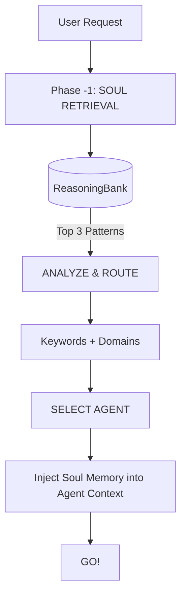

# Intelligent Agent Routing (With Self-Evolving Soul 🦞)

**Purpose**: Automatically analyze user requests, retrieve past "Soul Memory", and route them to the most appropriate specialist agent(s).

## Core Principle

> **The AI acts as an evolving entity**, retrieving wisdom from the **ReasoningBank** before every specialist invocation.

## How It Works

### 1. Request Analysis & Soul Retrieval

Before responding to ANY user request, perform the following:



### 2. Agent Selection Matrix

**Use this matrix to automatically select agents:**

| User Intent         | Keywords                                   | Selected Agent(s)                           | Auto-invoke? |
| ------------------- | ------------------------------------------ | ------------------------------------------- | ------------ |
| **Authentication**  | "login", "auth", "signup", "password"      | `security-auditor` + `backend-specialist`   | ✅ YES       |
| **UI Component**    | "button", "card", "layout", "style"        | `frontend-specialist`                       | ✅ YES       |
| **Mobile UI**       | "screen", "navigation", "touch", "gesture" | `mobile-developer`                          | ✅ YES       |
| **API Endpoint**    | "endpoint", "route", "API", "POST", "GET"  | `backend-specialist`                        | ✅ YES       |
| **Database**        | "schema", "migration", "query", "table"    | `database-architect` + `backend-specialist` | ✅ YES       |
| **Bug Fix**         | "error", "bug", "not working", "broken"    | `debugger`                                  | ✅ YES       |
| **Test**            | "test", "coverage", "unit", "e2e"          | `test-engineer`                             | ✅ YES       |
| **Deployment**      | "deploy", "production", "CI/CD", "docker"  | `devops-engineer`                           | ✅ YES       |
| **Security Review** | "security", "vulnerability", "exploit"     | `security-auditor` + `penetration-tester`   | ✅ YES       |
| **Performance**     | "slow", "optimize", "performance", "speed" | `performance-optimizer`                     | ✅ YES       |
| **Product Def**     | "requirements", "user story", "backlog", "MVP" | `product-owner`                             | ✅ YES       |
| **New Feature**     | "build", "create", "implement", "new app"  | `orchestrator` → multi-agent                | ⚠️ ASK FIRST |
| **Complex Task**    | Multiple domains detected                  | `orchestrator` → multi-agent                | ⚠️ ASK FIRST |

### 3. Automatic Routing Protocol

## TIER 0 - Automatic Analysis (ALWAYS ACTIVE)

Before responding to ANY request:

```javascript
// Pseudo-code for decision tree
async function analyzeRequest(userMessage) {
    // 1. Phase -1: Soul Retrieval (NEW)
    const soulMemory = await retrieveSoulMemory(userMessage, 3);

    // 2. Classify request type
    const requestType = classifyRequest(userMessage);

    // 3. Detect domains
    const domains = detectDomains(userMessage);

    // 4. Determine complexity
    const complexity = assessComplexity(domains);

    // 5. Select agent(s)
    let selectedAgents;
    if (complexity === "SIMPLE" && domains.length === 1) {
        selectedAgents = selectSingleAgent(domains[0]);
    } else if (complexity === "MODERATE" && domains.length <= 2) {
        selectedAgents = selectMultipleAgents(domains);
    } else {
        selectedAgents = ["orchestrator"];
    }

    // 6. Prepend Soul Memory to first prompt (NEW)
    return {
        agents: selectedAgents,
        promptInjection: soulMemory
    };
}
```

### 4. The Handshake Routing Protocol (Efficiency Model 🦞)

**Goal**: Maximize accuracy while minimizing token cost using tiered model coordination.

| Tier | Agent | Model | Task | Autonomy |
| :--- | :--- | :--- | :--- | :--- |
| **Tier 1: SCOUT** | `explorer-agent` | `lite` | Discovery, Search, List Files | **FULL** (Autonomous) |
| **Tier 2: BUILDER**| Specialist Agent | `pro` | Implementation, Reasoning | **GUIDED** |
| **Tier 3: SENTRY** | `test-engineer` | `flash` | Verification, Linting | **STRICT** |

#### The Implementation Flow:
1. **Scout Discovery**: If the task is unclear or spans multiple files, the Scout first runs `find_by_name` or `grep_search`.
2. **Context Trimming**:
    - **General Tasks**: 50-line window.
    - **Architectural Tasks**: 100-line window around matches.
3. **The Handshake**: The Scout passes the *trimmed* context to the Builder.
4. **Sentry Check**: If the Sentry (cheap model) detects a regression in the Builder's work: **STOP & ASK**.

---

## 5. Scout Autonomy Rules

1. **Scout is authorized to**:
    - List any directory.
    - Search for patterns in codebase.
    - Read file outlines.
2. **Scout is FORBIDDEN to**:
    - Edit files.
    - Access external URLs.
    - Commit code.

---

## 6. Response Format

**When auto-selecting an agent, inform the user concisely:**

```markdown
🤖 **Applying knowledge of `@security-auditor` + `@backend-specialist`...**

[Proceed with specialized response]
```

**Benefits:**

- ✅ User sees which expertise is being applied
- ✅ Transparent decision-making
- ✅ Still automatic (no /commands needed)

## Domain Detection Rules

### Single-Domain Tasks (Auto-invoke Single Agent)

| Domain          | Patterns                                   | Agent                   |
| --------------- | ------------------------------------------ | ----------------------- |
| **Security**    | auth, login, jwt, password, hash, token    | `security-auditor`      |
| **Frontend**    | component, react, vue, css, html, tailwind | `frontend-specialist`   |
| **Backend**     | api, server, express, fastapi, node        | `backend-specialist`    |
| **Mobile**      | react native, flutter, ios, android, expo  | `mobile-developer`      |
| **Database**    | prisma, sql, mongodb, schema, migration    | `database-architect`    |
| **Testing**     | test, jest, vitest, playwright, cypress    | `test-engineer`         |
| **DevOps**      | docker, kubernetes, ci/cd, pm2, nginx      | `devops-engineer`       |
| **Debug**       | error, bug, crash, not working, issue      | `debugger`              |
| **Performance** | slow, lag, optimize, cache, performance    | `performance-optimizer` |
| **SEO**         | seo, meta, analytics, sitemap, robots      | `seo-specialist`        |
| **Game**        | unity, godot, phaser, game, multiplayer    | `game-developer`        |

### Multi-Domain Tasks (Auto-invoke Orchestrator)

If request matches **2+ domains from different categories**, automatically use `orchestrator`:

```text
Example: "Create a secure login system with dark mode UI"
→ Detected: Security + Frontend
→ Auto-invoke: orchestrator
→ Orchestrator will handle: security-auditor, frontend-specialist, test-engineer
```

## Complexity Assessment

### SIMPLE (Direct agent invocation)

- Single file edit
- Clear, specific task
- One domain only
- Example: "Fix the login button style"

**Action**: Auto-invoke respective agent

### MODERATE (2-3 agents)

- 2-3 files affected
- Clear requirements
- 2 domains max
- Example: "Add API endpoint for user profile"

**Action**: Auto-invoke relevant agents sequentially

### COMPLEX (Orchestrator required)

- Multiple files/domains
- Architectural decisions needed
- Unclear requirements
- Example: "Build a social media app"

**Action**: Auto-invoke `orchestrator` → will ask Socratic questions

## Implementation Rules

### Rule 1: Silent Analysis

#### DO NOT announce "I'm analyzing your request..."

- ✅ Analyze silently
- ✅ Inform which agent is being applied
- ❌ Avoid verbose meta-commentary

### Rule 2: Inform Agent Selection

**DO inform which expertise is being applied:**

```markdown
🤖 **Applying knowledge of `@frontend-specialist`...**

I will create the component with the following characteristics:
[Continue with specialized response]
```

### Rule 3: Seamless Experience

**The user should not notice a difference from talking to the right specialist directly.**

### Rule 4: Override Capability

**User can still explicitly mention agents:**

```text
User: "Use @backend-specialist to review this"
→ Override auto-selection
→ Use explicitly mentioned agent
```

## Edge Cases

### Case 1: Generic Question

```text
User: "How does React work?"
→ Type: QUESTION
→ No agent needed
→ Respond directly with explanation
```

### Case 2: Extremely Vague Request

```text
User: "Make it better"
→ Complexity: UNCLEAR
→ Action: Ask clarifying questions first
→ Then route to appropriate agent
```

### Case 3: Contradictory Patterns

```text
User: "Add mobile support to the web app"
→ Conflict: mobile vs web
→ Action: Ask: "Do you want responsive web or native mobile app?"
→ Then route accordingly
```

## Integration with Existing Workflows

### With /orchestrate Command

- **User types `/orchestrate`**: Explicit orchestration mode
- **AI detects complex task**: Auto-invoke orchestrator (same result)

**Difference**: User doesn't need to know the command exists.

### With Socratic Gate

- **Auto-routing does NOT bypass Socratic Gate**
- If task is unclear, still ask questions first
- Then route to appropriate agent

### With GEMINI.md Rules

- **Priority**: GEMINI.md rules > intelligent-routing
- If GEMINI.md specifies explicit routing, follow it
- Intelligent routing is the DEFAULT when no explicit rule exists

## Testing the System

### Test Cases

#### Test 1: Simple Frontend Task

```text
User: "Create a dark mode toggle button"
Expected: Auto-invoke frontend-specialist
Verify: Response shows "Using @frontend-specialist"
```

#### Test 2: Security Task

```text
User: "Review the authentication flow for vulnerabilities"
Expected: Auto-invoke security-auditor
Verify: Security-focused analysis
```

#### Test 3: Complex Multi-Domain

```text
User: "Build a chat application with real-time notifications"
Expected: Auto-invoke orchestrator
Verify: Multiple agents coordinated (backend, frontend, test)
```

#### Test 4: Bug Fix

```text
User: "Login is not working, getting 401 error"
Expected: Auto-invoke debugger
Verify: Systematic debugging approach
```

## Performance Considerations

### Token Usage

- Analysis adds ~50-100 tokens per request
- Tradeoff: Better accuracy vs slight overhead
- Overall SAVES tokens by reducing back-and-forth

### Response Time

- Analysis is instant (pattern matching)
- No additional API calls required
- Agent selection happens before first response

## User Education

### Optional: First-Time Explanation

If this is the first interaction in a project:

```markdown
💡 **Tip**: I am configured with automatic specialist agent selection.
I will always choose the most suitable specialist for your task. You can
still mention agents explicitly with `@agent-name` if you prefer.
```

## Debugging Agent Selection

### Enable Debug Mode (for development)

Add to GEMINI.md temporarily:

```markdown
## DEBUG: Intelligent Routing

Show selection reasoning:

- Detected domains: [list]
- Selected agent: [name]
- Reasoning: [why]
```

## Summary

**intelligent-routing skill enables:**

✅ Zero-command operation (no need for `/orchestrate`)
✅ Automatic specialist selection based on request analysis
✅ Transparent communication of which expertise is being applied
✅ Seamless integration with existing workflows
✅ Override capability for explicit agent mentions
✅ Fallback to orchestrator for complex tasks

**Result**: User gets specialist-level responses without needing to know the system architecture.

---

**Next Steps**: Integrate this skill into GEMINI.md TIER 0 rules.
